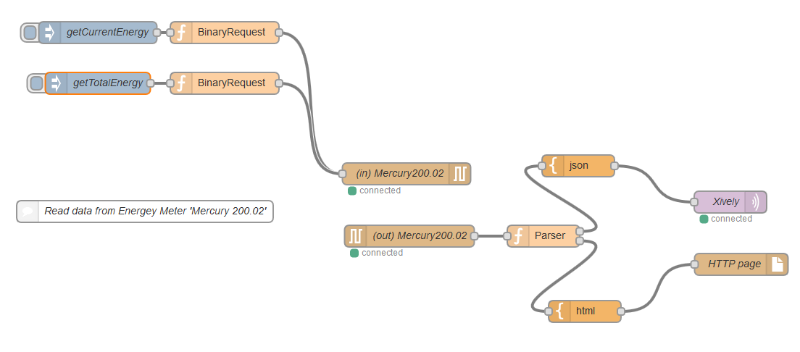

Меркурий 200.02 <-> RS485
===============================

Исследование протокола связи электросчетчика Меркурий 200.02
(Energy power meter Mercury 200.02 communication protocol)

**!Обновлено 2019**
Производитель наконец выложил собственную документацию по протоколу обмена:
* [Протокол обмена однофазных счетчиков Меркурий 200, 201, 203 (кроме Меркурий 203.2TD), 206](https://www.incotexcom.ru/files/em/docs/mercury-protocol-obmena-1.pdf)
* [Протокол обмена трёхфазных счетчиков Меркурий (Mercury) 203.2TD, 204, 208, 230, 231, 234, 236, 238](https://www.incotexcom.ru/files/em/docs/merkuriy-sistema-komand-ver-1-2021-05-05.pdf)

Электросчетчик [Меркурий 200.02](http://www.incotexcom.ru/m200.htm) имеет собственный протокол поверх rs-485.  

Скрипт **mercury200-sendcmd.php** отправляет команды электросчетчику и считывать ответы с него. Протокол обмена производитель свободно не распространяет. Ниже наработки по его реверсингу.   
В каталоге *examples* пример php-cкрипта для получения параметров электросети и отправки их в облако [Xively](https://xively.com/feeds/19249442) для сохранения графиков. 
Там же код потока для Node-RED, с помощью которого можно работать со счетчиком. 

Протокол обмена "Меркурий 200"
===============================
Для общения со счетчиком необходимо знать его адрес. Для модели 200.02 это последние 6 цифр серийного номера. В моем случае это `411486` в десятичном представлении либо `06 47 5E` в hex

### Формат запроса

Стартовый байт | Адрес счетчика | Запрос | CRC16 (Modbus)
:---: | :---: | :---: | :---: 
*1 байт* | *3 байта* | *1 байт* | *2 байта*
`00` | `06 47 5E` 

### Формат ответа

Стартовый байт| Адрес счетчика | Запрос (на который отвечаем) | Ответ | [CRC16 (Modbus)](http://www.php.net/manual/ru/function.crc32.php#64127)
 :---: | :---: | :---: | :---: | :---: 
*1 байт* | *3 байта* | *1 байт* | |*2 байта*
`00` | `06 47 5E` | 

### Коды запросов и ответов

Запрос (hex) |  Описание команды |  Ответ
 :------------: | :---------------- | ---------------
`21` | Текущая дата и время
`22` | Лимит мощности | 99990 Вт
`23` | Лимит энергии | 9999 квт*ч
`24` | Флаг перехода зимнее.летнее
`25` | Флаг разрешения коррекции времени кнопками   
`26` | Чтение мощности   
`27` | Значение энергии | *[16 байт]* [4] Тариф1 [4] Тариф2 [4] Тариф3 [4] Тариф4  Результат в (кВт*ч)*100
`28` | Версия | байт версии, байт подверсии
`29` | Напряжение встроенной батарейки | *[2 байта]* [1] Единицы Вольт [1] Десятые доли Вольт
`2A` | Индикация на дисплее
`2B` | Время последнего выключения                           
`2C` | Время последнего включения 
`2D` | Функция испульсного выхода чтение
`2F` | Серийный номер
`31` | Тарифное расписание                          
`63` | Текущие параметры электросети  | *[7 байт]* [2] Напряжение в Вольт*10 [2] Ток в Ампер*100 [3] Мощность в Ваттах                                              
`65` | Служебная информация    
`66` | Дата изготовления | *[2 байта]* [1] день [1] месяц [1] год
`67` | Индикация на дисплее                           
`87` | Служебная информация                         

### Примеры
*Чтение параметров электросети*  
Запрос: `00` `06 47 5E` `63` `EC D4`  
Ответ:  `00` `06 47 5e` `63` `23 58` `02 64` `00 05 88` `45c6`  
235,8 Вольт; 2,64 Ампера; 588 Ватт  

*Чтение накопленная энергии*  
Запрос: `00` `06 47 5E` `27` `ECE7`  
Ответ:  `00` `06 47 5E` `27` `00062142` `00020834` `00000000` `00000000` `59F5`  
621,42 кВт*ч(Т1); 208,34 кВт*ч(Т2);  0 кВт*ч(Т3); 0 кВт*ч(Т4)  

